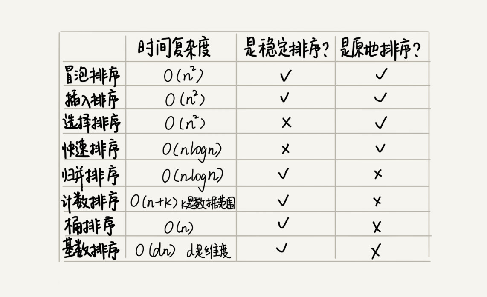

### 结构
list 链表
recursive 递归
sort 排序
stack 栈
search 搜索
leetcode leetcode 上的题目
offer 剑指 offer 上的题目
awesome 偶尔看到的题目
### 需要回顾
1. 合并两条有序列表，需要用哨兵简化边际条件判断 MergeTwoLists
2. 移除单链表倒数第几项，需要用哨兵简化边际条件判断 RemoveNthFromEnd
3. NextGreater
4. 冒泡和选择排序不要混淆了，插入排序记得插入的操作在位移操作之后（腾出插入的位置）
5. 并归排序，快速排序多看看
6. 用快排的分区思想在时间复杂度为 O(n) 里面找的第 K 大或小的数。
7. 计数排序 CountingSort，不难理解，但是容易忘，需要多看看，最后排序的时候从后往前排是为了保证算法稳定
8. 桶排序，把数组按大小分成 n 个桶，桶内用快速排序.要求：
    a. 要排序的数据需要很容易就能划分成 m 个桶，桶与桶之间有着天然的大小顺序
    b. 数据在各个桶之间的分布是比较均匀
9. 基数排序：基数排序要求数据可以划分成高低位，位之间有递进关系，用稳定排序算法依次按低位到高位排序
10. 快速排序，选择排序，堆排序，希尔排序都是不稳定排序

11. 二分查找的变形，需要多回顾 BinarySearchPlus，！！！！！
12. HashMap
hash 算法
~~~ java
    static final int hash(Object key) {
        int h;
        return (key == null) ? 0 : (h = key.hashCode()) ^ (h >>> 16);
    }
~~~
^ 运算是为了 hash 值里面有高位和低位的信息，
计算 index 的方法, 因为 capacity 是 2 的整数次方，所以(capacity -1)最终是 00……0111……1 的类似的值，本质上 & 运算就是取余数
~~~ java
    int index = hash(key) & (capacity - 1);
~~~
13. BF 算法中的 BF 是 Brute Force 的缩写，中文叫作暴力匹配算法，也叫朴素匹配算法;
RK 算法的全称叫 Rabin-Karp 算法，是由它的两位发明者 Rabin 和 Karp 的名字来命名的,是 BF 算法的升级版;
BM（Boyer-Moore）算法,33 篇多看看;
14. 双链表交换节点特别注意相邻两个节点的交换，如果可以还是直接交换节点里面的值
